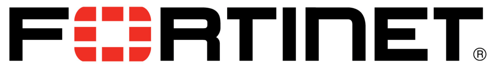
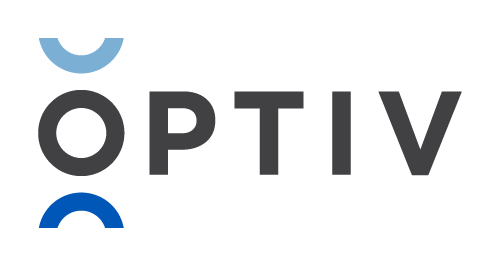

---

layout: col-sidebar
title: OWASP Edmonton
tags: Edmonton
region: North America
country: Canada 
meetup-group: owasp-edmonton
postal-code: T5J 0R2

---
meetup-group: owasp-edmonton

. 

Welcome!
-----------------

Welcome to the OWASP Edmonton Chapter!

We are excited to offer a place to collaborate and grow Cybersecurity in the Edmonton area.

<h2>Chapter Supporters</h2>

  <table>
    <thead>
      <tr>
        <th>Heading 1</th>
        <th>Heading 2</th>
        <th>Heading 3</th>
      </tr>
    </thead>
    <tbody>
      <tr>
        <td></td>
        <td></td>
        <td></td>
      </tr>
      <tr>
        <td></td>
        <td></td>
        <td></td>
      </tr>
      <tr>
        <td></td>
        <td></td>
        <td></td>
    </tbody>
  </table>

-----------------------------------------------------------------------------------------------------------------------------------
Our events are open to the public, and you do not need to be a member to attend. Please do consider [joining OWASP](https://owasp.org/membership/) if you find our community, projects, and meetings valuable, or sponsoring this chapter.

### Contact

Feel free to reach out! 
 [Donald Ashdown](mailto:donald.ashdown@owasp.org) - Community Organizer
 [Brad Ballard](mailto:brad.ballard@owasp.org)

