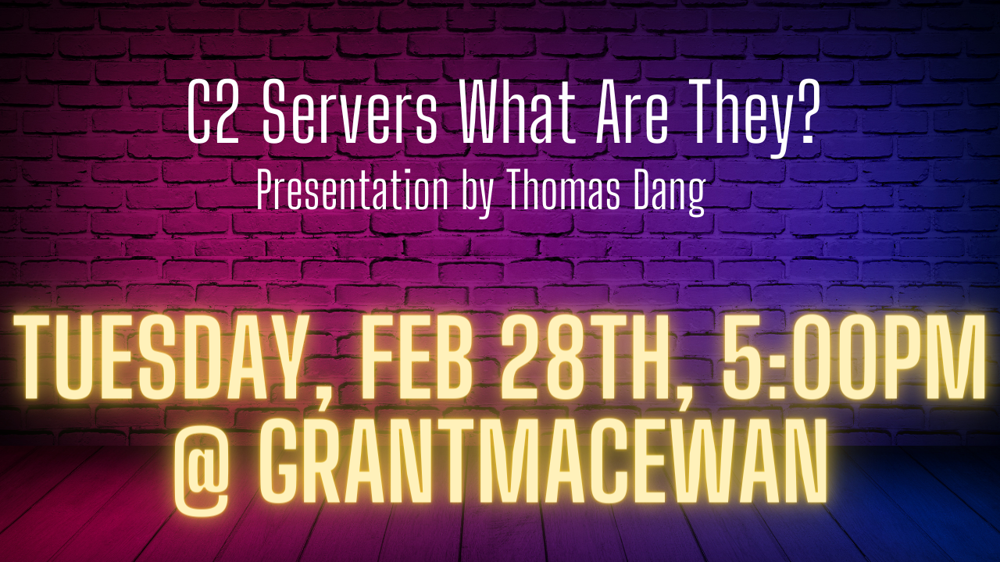

---

layout: col-sidebar
title: OWASP Edmonton
tags: edmonton
region: North America
meetup-group: meetup-group-opbybwve
postal-code: T5J 0R2

---

Welcome!
-----------------

Welcome to the OWASP Edmonton Chapter!

We are excited to offer a place to collaberate and grow Cybersecurity in the Edmonton area.

<h2>Chapter Supporters</h2>
The following is a list of organizations that have generously supported the OWASP edmonton chapter through contributions.

<h2>Chapter Supporters Providing Space</h2>

<h2>Chapter Supporters Providing Food</h2>

<h2>Upcoming Events</h2>
<h3> Febuary OWASP Edmonton Online CTF Event </h3>

An online event where we will work on Try Hack Me King of the Hill.

Google Meet joining info
CTF Online Event
<b>Tuesday, February 21 · 6:30 – 8:30pm</b>
Google Meet joining info
Video call link: https://meet.google.com/uzv-zqcq-rsg
Or dial: ‪(US) +1 904-580-8855‬ PIN: ‪495 302 301‬#
We will be working on a live Attack and Defend scenario from the Try Hack Me platform, in particular, king of the hill. The goal of this meeting is to bring OWASP Edmonton members together and provide a valuable networking/learning experience.

<h3> Febuary OWASP Edmonton Monthly Presentation </h3>

An in person event for all members hosted at <b>Grant MacEwan in building 5, room 110.</b>

Presentation by Thomas Dang. 

1. C2's What are they and how are they used in CTFs 
2. Common C2s/The C2 Matrix
3. Basic Metasploit demo
4. Basic Sliver demo
5. QA

-----------------------------------------------------------------------------------------------------------------------------------
Our events are open to the public, and you do not need to be a member to attend. Please do consider [joining OWASP](https://owasp.org/membership/) if you find our community, projects, and meetings valuable, or sponsoring this chapter.

### Contact

Feel free to reach out! 
 [Donald Ashdown](mailto:donald.ashdown@owasp.org) - Community Organizer
 [Brad Ballard](mailto:brad.ballard@owasp.org)

