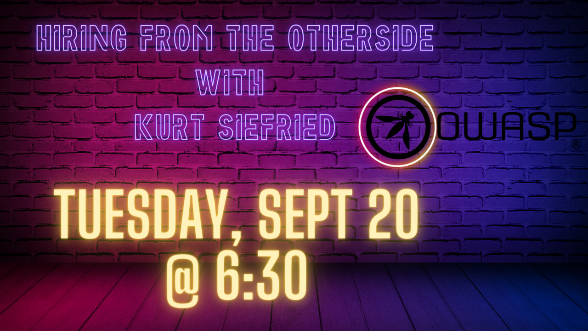
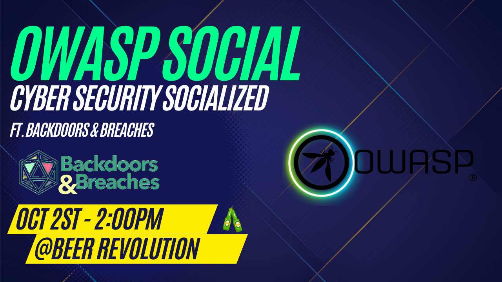

---

layout: col-sidebar
title: OWASP Edmonton
tags: edmonton
region: North America
meetup-group: meetup-group-opbybwve
postal-code: T5J 0R2

---

Welcome!
-----------------

Welcome to the OWASP Edmonton Chapter!

We are excited to offer a place to collaberate and grow Cybersecurity in the Edmonton area.

 
<h2>Upcoming meetings and events</h2>

<!-- Event template 

<h3> Tuesday September 20 2022 7:30 PM - Monthly presentation - Kurt Siefried- Hiring from the otherside</h3>
 
Kurt Siefried - Hiring from the other side: This is a presentation with some actionable advice for job seekers.

Kurt Seifried is an Information Security Strategist with real-world experience: Red Hat Product Security (Cloud products), Director of IT Cloud Security Alliance, Open Source Security Podcast #osspodcast and member of the CVE Editorial Board (and issuer of ~6,000 CVEs). He has now moved into the world of Distributed Ledger Technology (aka Blockchain) security.
 -->
 
 
 <h3> Sunday October 2 2022 3 PM - Backdoors and Breaches at Beer Revolution. (11736 104 Ave NW, Edmonton, AB)</h3>
 
Backdoors & Breaches is an Incident Response Card Game, from Black Hills Information Security and Active Countermeasures. Backdoors & Breaches contains 52 unique cards to help you conduct incident response tabletop exercises and learn attack tactics, tools, and methods.

Our meetings are open to the public, and you do not need to be a member to attend. Please do consider [joining OWASP](https://owasp.org/membership/) if you find our community, projects, and meetings valuable, or sponsoring this chapter.

### Contact

Feel free to reach out! 
 [Donald Ashdown](mailto:donald.dashdown@owasp.org)
 [Brad Ballard](mailto:brad.ballard@owasp.org)

