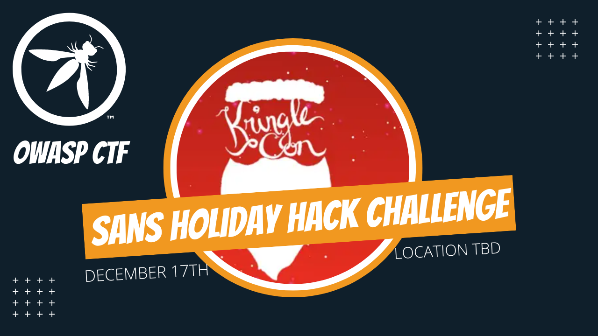
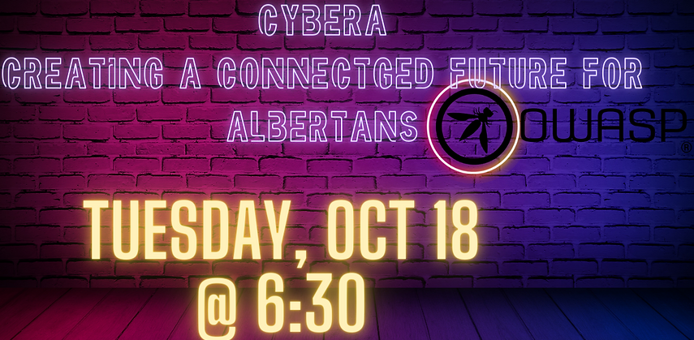

---

layout: col-sidebar
title: OWASP Edmonton
tags: edmonton
region: North America
meetup-group: meetup-group-opbybwve
postal-code: T5J 0R2

---

Welcome!
-----------------

Welcome to the OWASP Edmonton Chapter!

We are excited to offer a place to collaberate and grow Cybersecurity in the Edmonton area.

<h2>Chapter Supporters</h2>
The following is a list of organizations that have generously supported the OWASP edmonton chapter through contributions.

                                      
<h2>Upcoming meetings and events</h2>

<!-- Event template 

<h3> Saturday December 17th 2022 11:00am - SANS Kringle Con Holiday Hack Challenge & Lunch</h3>
 
Join the global cybersecurity community in its most festive cyber security challenge and virtual conference of the year. The SANS Holiday Hack Challenge is a FREE series of super fun, high-quality, hands-on cybersecurity challenges. The SANS Holiday Hack Challenge is for all skill levels, with a stellar prize at the end for the best of the best entries.

https://www.sans.org/mlp/holiday-hack-challenge/

 -->
 
 
 <h3> Sunday October 2 2022 3 PM - Backdoors and Breaches at Beer Revolution. (11736 104 Ave NW, Edmonton, AB)</h3>
 
Backdoors & Breaches is an Incident Response Card Game, from Black Hills Information Security and Active Countermeasures. Backdoors & Breaches contains 52 unique cards to help you conduct incident response tabletop exercises and learn attack tactics, tools, and methods.

 <h3> Tuesday October 18 2022 6:30 PM - Monthly presentation - Cybera</h3>
 
Monthly presentation with Cybera - Creating a connected future for albertans.

Our meetings are open to the public, and you do not need to be a member to attend. Please do consider [joining OWASP](https://owasp.org/membership/) if you find our community, projects, and meetings valuable, or sponsoring this chapter.

### Contact

Feel free to reach out! 
 [Donald Ashdown](mailto:donald.ashdown@owasp.org)
 [Brad Ballard](mailto:brad.ballard@owasp.org)

