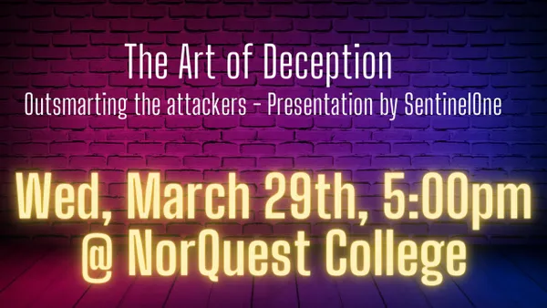

---

layout: col-sidebar
title: OWASP Edmonton
tags: edmonton
region: North America
meetup-group: meetup-group-opbybwve
postal-code: T5J 0R2

---

Welcome!
-----------------

Welcome to the OWASP Edmonton Chapter!

We are excited to offer a place to collaberate and grow Cybersecurity in the Edmonton area.

<h2>Chapter Supporters</h2>
The following is a list of organizations that have generously supported the OWASP edmonton chapter through contributions.

<h2>Chapter Supporters Providing Space</h2>

<h2>Chapter Supporters Providing Food</h2>

<h2>Upcoming Events</h2>
<h3> The Art of Deception - Outsmarting the Attackers </h3>

Location
10215 108 St NW, Edmonton, AB T5J 1L6
Room 2-013 - SCFL - Downtown

## About The Event###

🍗🍗🍗 🥤🥤🥤 🏆🏆🏆
RSVP for CATERING COMPANY + DOOR PRIZES
👇👇👇👇👇👇👇👇👇👇👇👇👇👇👇👇👇👇👇👇
https://www.meetup.com/meetup-group-opbybwve/

SentinelOne is sending a squadron of their finest experts to share their knowledge on the elusive art of MITRE deception.

As a pioneering force in this field, they will be providing not only a delectable BBQ DINNER catered by Edmonton's local CORNERSTONE BBQ, but also valuable insights on how to outsmart the crafty attackers. Think of it as a masterclass on the tactics and strategies needed to protect your organization from cyber-attacks.

In the words of the renowned ancient Chinese general Sun Tzu, "All warfare is based on deception." And just as Sun Tzu believed in the importance of deception in warfare, Sentinel One understands the significance of deception in the ever-evolving battlefield of cybersecurity. So, join us for this informative session, and let's learn how to effectively deploy deception techniques to turn the tables on attackers.

-----------------------------------------------------------------------------------------------------------------------------------
Our events are open to the public, and you do not need to be a member to attend. Please do consider [joining OWASP](https://owasp.org/membership/) if you find our community, projects, and meetings valuable, or sponsoring this chapter.

### Contact

Feel free to reach out! 
 [Donald Ashdown](mailto:donald.ashdown@owasp.org) - Community Organizer
 [Brad Ballard](mailto:brad.ballard@owasp.org)

