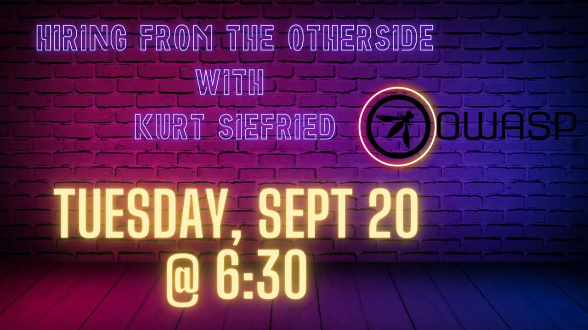

---

title: PastEvents
displaytext: Past Events
layout: null
tab: true
order: 2
tags: DKTE

---

## Past Events

<h3> Tuesday September 20 2022 7:30 PM - Monthly presentation - Kurt Siefried- Hiring from the otherside</h3>
 
Kurt Siefried - Hiring from the other side: This is a presentation with some actionable advice for job seekers.

Kurt Seifried is an Information Security Strategist with real-world experience: Red Hat Product Security (Cloud products), Director of IT Cloud Security Alliance, Open Source Security Podcast #osspodcast and member of the CVE Editorial Board (and issuer of ~6,000 CVEs). He has now moved into the world of Distributed Ledger Technology (aka Blockchain) security.
